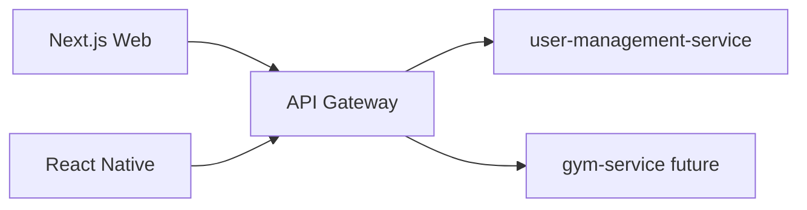

# HealthOS Frontend Handoff

Share this document with the web and mobile developer. It describes screens, routes, API contracts, and role-based behavior for the **Gym portal** (extensible to Clinic/Nutrition later).

## Stack

| Layer | Technology |
|-------|------------|
| Web admin | Next.js 15 (App Router), TypeScript, TanStack Query, Axios |
| Mobile | React Native CLI (existing `mobile-app/`) |
| API base | `https://api.healthos.example` (gateway port `8080` locally) |
| Auth | JWT access + refresh token (already implemented) |

## Architecture overview



- **user-management-service**: identity, global roles, scoped memberships, health profile
- **gym-service** (next phase): organizations, gyms, members, billing
- **Health profile** (`/me/profile`) is separate from RBAC — never store roles in profile UI state

## Roles and app shells

| Shell | Scoped / global roles | Primary platform |
|-------|----------------------|------------------|
| Platform Admin | `SUPER_ADMIN`, `ADMIN` | Web |
| Gym Owner | `GYM_OWNER` on `ORGANIZATION` scope | Web |
| Gym Manager | `GYM_MANAGER` on `LOCATION` scope | Web + Mobile |
| Staff / Trainer | `STAFF`, `TRAINER` on `LOCATION` scope | Mobile |
| Member | `MEMBER` on `LOCATION` scope | Mobile |

## Auth flow (frontend)

1. `POST /auth/login` or OTP/Google via gateway
2. Store `accessToken` + `refreshToken`
3. `GET /me/memberships` — build navigation from returned memberships
4. If user has multiple `LOCATION` memberships, show **Select Gym** screen
5. `POST /me/active-scope` with chosen gym — persisted server-side
6. On gym-service calls, rely on gateway-forwarded scope headers from JWT (`X-Scope-Id`, `X-Portal-Type`, `X-Scope-Type`)

### Token refresh

On 401, call `POST /auth/refresh`, replace tokens, retry request.

## API contracts (user-management)

### `GET /me/memberships`

Response:

```json
{
  "memberships": [
    {
      "portal": "GYM",
      "scopeType": "ORGANIZATION",
      "scopeId": "uuid",
      "role": "GYM_OWNER"
    },
    {
      "portal": "GYM",
      "scopeType": "LOCATION",
      "scopeId": "uuid",
      "role": "GYM_MANAGER"
    }
  ],
  "activeScope": {
    "portal": "GYM",
    "scopeType": "LOCATION",
    "scopeId": "uuid"
  }
}
```

### `POST /me/active-scope`

Request:

```json
{
  "portal": "GYM",
  "scopeType": "LOCATION",
  "scopeId": "uuid"
}
```

### `POST /scoped-memberships` (owner / manager)

Assign manager or staff to a gym:

```json
{
  "userId": "target-user-uuid",
  "portalType": "GYM",
  "scopeType": "LOCATION",
  "scopeId": "gym-uuid",
  "roleName": "GYM_MANAGER"
}
```

Allowed `roleName` values: `GYM_OWNER`, `GYM_MANAGER`, `TRAINER`, `STAFF`, `MEMBER`

### `GET /scoped-memberships?portalType=GYM&scopeType=LOCATION&scopeId={uuid}`

List assignments for a scope (requires manage access on that scope).

### `DELETE /scoped-memberships/{id}`

Revoke an assignment.

### Health profile (unchanged)

- `GET /me/profile`
- `PUT /me/profile`

Fields: `height`, `weight`, `gender`, `dateOfBirth`, `goal`

## Web screens (Next.js) — 22 total

### Auth (4)

| # | Screen | Route |
|---|--------|-------|
| 1 | Login | `/login` |
| 2 | OTP verify | `/otp` |
| 3 | Forgot password | `/forgot-password` |
| 4 | Select active gym | `/select-gym` |

### Gym Owner (8)

| # | Screen | Route |
|---|--------|-------|
| 5 | Owner dashboard | `/owner/dashboard` |
| 6 | Organizations list | `/owner/organizations` |
| 7 | Create / edit organization | `/owner/organizations/new`, `/owner/organizations/[id]` |
| 8 | Gyms list | `/owner/gyms` |
| 9 | Create / edit gym | `/owner/gyms/new`, `/owner/gyms/[id]` |
| 10 | Assign gym manager | `/owner/managers` |
| 11 | Org staff overview | `/owner/staff` |
| 12 | Org settings | `/owner/settings` |

### Gym Manager (6)

| # | Screen | Route |
|---|--------|-------|
| 13 | Manager dashboard | `/manager/dashboard` |
| 14 | Staff list | `/manager/staff` |
| 15 | Invite / add staff | `/manager/staff/invite` |
| 16 | Members list | `/manager/members` |
| 17 | Member detail | `/manager/members/[id]` |
| 18 | Gym settings | `/manager/settings` |

### Platform Admin (4)

| # | Screen | Route |
|---|--------|-------|
| 19 | Users list | `/admin/users` |
| 20 | User detail + roles | `/admin/users/[id]` |
| 21 | Roles & permissions | `/admin/roles` |
| 22 | Audit log placeholder | `/admin/audit` |

## Mobile screens (React Native) — 14 total

### Existing (wire to APIs + role guards)

| # | Screen | Status |
|---|--------|--------|
| 1 | Splash | exists |
| 2 | Login | exists |
| 3 | OTP | exists |
| 4 | Dashboard | exists — make role-specific |
| 5 | Members | exists |
| 6 | Member details | exists |
| 7 | Profile (health kit) | exists |

### New

| # | Screen | Purpose |
|---|--------|---------|
| 8 | Select gym | multi-gym owner/manager |
| 9 | Staff list | manager |
| 10 | Staff invite | manager |
| 11 | My gym info | manager/staff |
| 12 | Member home | member workouts placeholder |
| 13 | Notifications inbox | future |
| 14 | Access denied | wrong role fallback |

## Role-based navigation rules

```typescript
// After GET /me/memberships
function resolveShell(memberships) {
  if (hasRole('SUPER_ADMIN') || hasRole('ADMIN')) return 'platform-admin';
  if (memberships.some(m => m.role === 'GYM_OWNER')) return 'gym-owner';
  if (memberships.some(m => m.role === 'GYM_MANAGER')) return 'gym-manager';
  if (memberships.some(m => m.role === 'TRAINER' || m.role === 'STAFF')) return 'staff';
  return 'member';
}
```

- **Gym manager** must only fetch data for `activeScope.scopeId`
- **Gym owner** sees all gyms under their org (from gym-service once built)
- Never use `/admin/users` for gym owner/manager flows — use `/scoped-memberships`

## Sprint plan

| Sprint | Deliverables |
|--------|--------------|
| 1 | Auth, memberships, select-gym, role-based layout (mock gym list) |
| 2 | Owner gym CRUD (gym-service) + assign manager UI |
| 3 | Manager staff + members screens |
| 4 | Member mobile + health profile |
| 5 | Platform admin screens |

## Local dev

```bash
# Backend
cp infra/.env.example infra/.env
docker compose -f infra/docker-compose.yml up -d --build

# Mobile
cd mobile-app && npm install && npm run android

# Swagger
open http://localhost:8080/swagger-ui.html
```

## Generic portal note

The same membership model supports other portals by changing `portalType`:

- `GYM` — gym management (this document)
- `CLINIC` — future clinic portal
- `NUTRITION` — future nutrition portal

Frontend should treat `portal` as a enum and avoid hardcoding "gym" in shared components.
