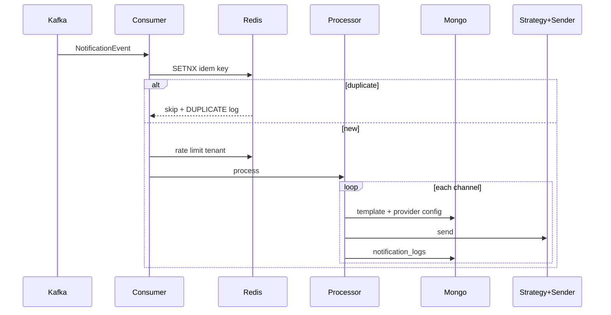
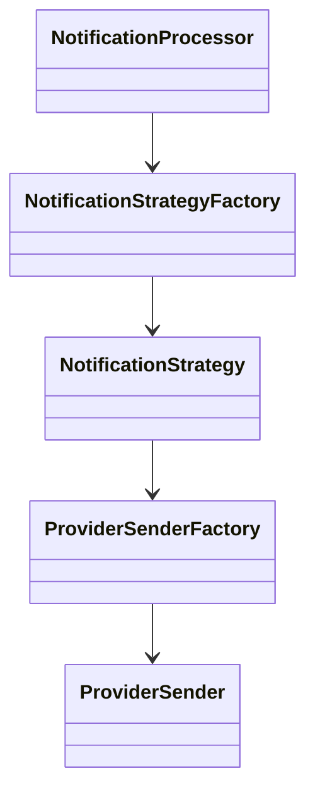

# HealthOS Notification Service

Event-driven notification microservice for HealthOS. Consumes Kafka events, renders Handlebars templates from MongoDB, resolves channel strategies via factory pattern, sends via dynamically configured providers, and persists audit logs.

## Stack

- Java 21, Spring Boot 3.5
- MongoDB (templates, provider configs, logs, topics)
- Kafka (`notification-topic`, retry, DLT)
- Redis (idempotency, rate limiting)
- Handlebars template engine
- JWT RBAC, OpenAPI, Actuator/Prometheus, structured JSON logging

## Quick start

```bash
cd notification-service
docker compose up -d --build
```

Service: `http://localhost:8082`  
Swagger: `http://localhost:8082/swagger-ui.html`  
Kafka UI: `http://localhost:8090`  
MailHog UI: `http://localhost:8025`

Local run (requires Mongo, Redis, Kafka):

```bash
mvn spring-boot:run
```

## Sample Kafka message

Topic: `notification-topic`

```json
{
  "eventId": "550e8400-e29b-41d4-a716-446655440000",
  "tenantId": "gym001",
  "topic": "MEMBERSHIP_EXPIRED",
  "channels": ["EMAIL", "SMS", "WHATSAPP"],
  "recipient": {
    "userId": "123",
    "email": "john@gmail.com",
    "mobile": "9999999999"
  },
  "variables": {
    "firstName": "John",
    "expiryDate": "2026-06-15",
    "gymName": "FitGym"
  }
}
```

## Processing flow



## REST APIs

| Method | Path | Roles |
|--------|------|-------|
| POST | `/templates` | SUPER_ADMIN, NOTIFICATION_ADMIN |
| PUT | `/templates/{id}` | SUPER_ADMIN, NOTIFICATION_ADMIN |
| GET | `/templates`, `/templates/{id}` | + READ_ONLY |
| DELETE | `/templates/{id}` | SUPER_ADMIN, NOTIFICATION_ADMIN |
| POST/PUT/GET | `/provider-configs` | same pattern |
| POST/GET | `/topics` | admin write, all read |
| GET | `/logs`, `/logs/{id}` | all authenticated read roles |
| GET | `/health` | public |

JWT: `Authorization: Bearer <token>` with `roles` claim (same secret as user-management-service).

## Seed data (Mongo)

**notification_templates**

```json
{
  "tenantId": "gym001",
  "topic": "MEMBERSHIP_EXPIRED",
  "channel": "EMAIL",
  "subject": "Membership Expiring Soon",
  "body": "Hello {{firstName}}, your membership expires on {{expiryDate}}",
  "active": true
}
```

**notification_provider_configs** (SMTP — real sending)

```json
{
  "tenantId": "gym001",
  "providerType": "EMAIL",
  "provider": "SMTP",
  "active": true,
  "config": {
    "host": "mailhog",
    "port": "1025",
    "auth": "false",
    "from": "noreply@healthos.test"
  }
}
```

SMS/WhatsApp providers (TWILIO, MSG91, META_WHATSAPP, GUPSHUP, AWS_SES) are registered as **stubs** — they log and return simulated success until real SDK integration is added.

## Architecture



## Package layout

```
com.healthos.notification
├── domain/
├── application/ (+ factory/, strategy/)
├── adapters/inbound/rest/, messaging/
├── adapters/outbound/persistence/, provider/, redis/, messaging/
├── config/
└── util/
```

## Tests

```bash
mvn test
```

Unit tests: factory, renderer, idempotency, processor.  
Integration tests (Testcontainers): template API, Kafka→Mongo flow.

## Suggested improvements

- Encrypt provider secrets (KMS/Jasypt); cache configs in Redis
- Per-channel partial failure (do not fail entire event)
- Schema registry for Kafka; DLT replay admin API
- Template versioning + preview endpoint; i18n
- Resilience4j circuit breakers per provider
- Real integrations for SES, Twilio, MSG91, Meta, Gupshup
- Fold services into monorepo `infra/docker-compose.yml` and api-gateway route
